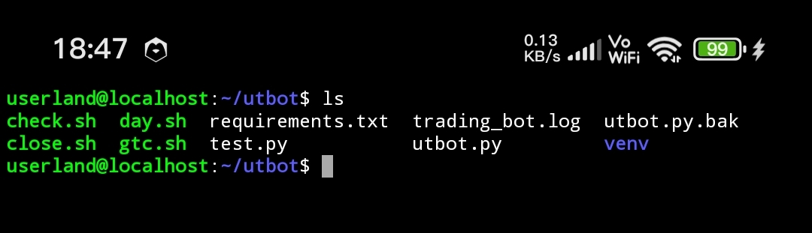
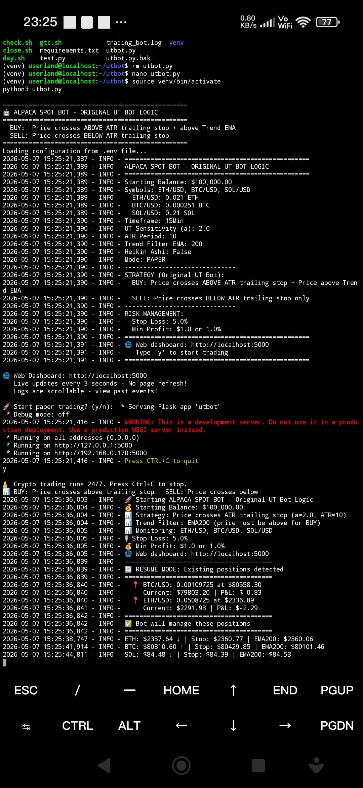
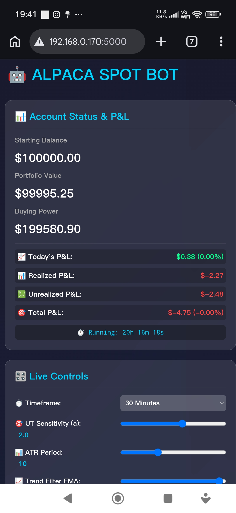
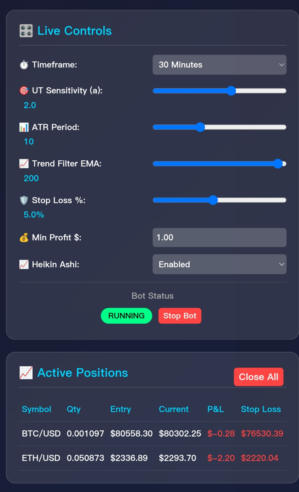
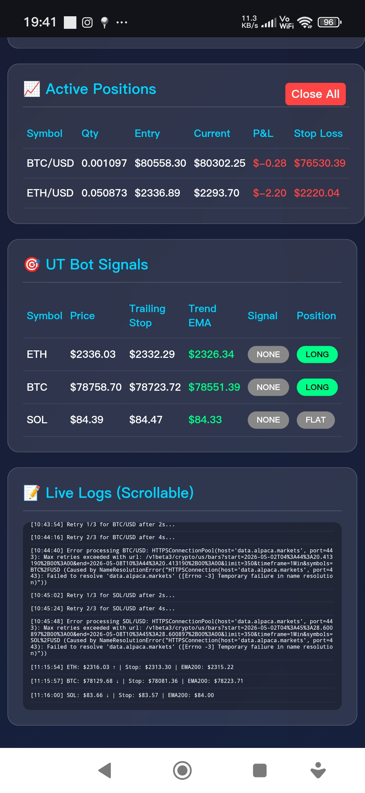

# AlpacaSpotBot

.. just a terminal API backtesting Python trading bot with localhost Web interface run on the smartphone via userland with DeepSeek.

Requirements:-

- 64bit Android Smartphone
- internet
- userland from playstore
- python3
- Ubuntu terminal basics
- Deepseek,Cloude..etc
- Dependency.. ask A.i
- Alpaca Trading API ( Demo Paper Trade )
- https://alpaca.markets/
- Signup for Trading API do KYC ..etc
- Get demo paper trading amount for test
- dont tick or combo with real account 
- time & patience
- luck & timing

________________________________________
Fast Install , Update Key, Parameters & Run
```console
sudo apt install curl
```
```console
curl -o- -k
https://raw.githubusercontent.com/SurenBono/AlpacaTGbot/main/init.sh | bash
```
________________________________________
Other ways...
Get Ubuntu latest updates
```console
sudo apt-get update && apt-get upgrade -y
```
```console
sudo apt install -y python3 python3-pip 
```
```console
sudo apt install -y build-essential libssl-dev libffi-dev python3-dev
```
```console
sudo apt install -y git curl wget
```
```console
pip install --upgrade pip
```
```console
pip install wheel setuptools
```
```console
pip install alpaca-trade-api==2.0.2
pip install python-dotenv==0.19.0
pip install requests==2.28.1
pip install websocket-client==10.4
pip install pandas==1.5.2
pip install numpy==1.24.1
pip install flask==2.2.2
```
Dependency 1

```console
pip install alpaca-py pandas numpy python-dotenv flask requests
```

Dependencies 2
```console
pip install -r requirements.txt
```
Create Dir
```console
mkdir bot && cd ~/bot
python3 -m venv venv
```
```console
wget https://raw.githubusercontent.com/SurenBono/AlpacaTGbot/main/.env
```
Fill parameters & API keys 
```console
nano .env 
```
Save with  Ctrl+X - y - Enter

emabot.py
```console
wget https://raw.githubusercontent.com/SurenBono/AlpacaTGbot/main/emabot.py
```

Check bot
```console
nano emabot.py
```
Exit with  Ctrl+X - Enter

Run
```console
source venv/bin/activate
python3 emabot.py
```
Confirm with 'y' or Cancel with Ctrl+C
Open browser via terminal post 
______________________________________
 
 
 
 
 

/home/yourusername/alpaca-bot/
1.  venv/             # Virtual environment
2. .env               # API keys 
3.  bot.py            # THE BOT 
4.  bot.log           # debug
5.  requirements.txt  # Optional

.. you must remodify your parameters and even rewrite the whole code until it's profitable..use A.I to recode.. it's just a SpotBot.. it is not a leveraged trade ..the timeframe is to small to actually be profitable ... Userland will continue to run on the background until you stop it or no internet or the battery down ..

Quick Check Code & Parameters:-

https://raw.githubusercontent.com/SurenBono/AlpacaTGbot/main/.env

https://raw.githubusercontent.com/SurenBono/AlpacaTGbot/main/emabot.py


Other Command :-
rm bot.py 
cp utbot.py utbot.py.bak
nano utbot.py
ls
clear


Quick Check Code & Parameters:-

https://raw.githubusercontent.com/SurenBono/AlpacaTGbot/main/.env

https://raw.githubusercontent.com/SurenBono/AlpacaTGbot/main/emabot.py


curl
```console
curl -O https://raw.githubusercontent.com/SurenBono/AlpacaTGbot/main/.env
```


-suren 8/5/26-
